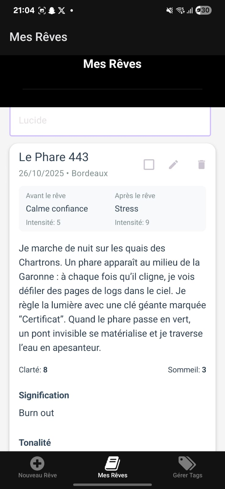

# ILLUSTRATIONS & JUSTIFICATION DU DESIGN

Ce chapitre documente les écrans réels de **DreamsApp** et les **choix UX/UI** qui les motivent : hiérarchie claire, composants cohérents, lisibilité et saisie fluide à une main.

---

## 1) Nouveau Rêve — entête & champs principaux

**Objectifs**
- Prioriser la **saisie immédiate** (Titre, Résumé, Date, Lieu).
- Reporter les éléments secondaires plus bas (**progressive disclosure**).

**Justifications**
- **App bar noire** : repère stable + contraste fort pour le titre.
- **Cartes aux coins arrondis** : blocs cognitifs, sensation de “sections” dans un long formulaire.
- **Inputs pleine largeur** : meilleures cibles tactiles (*Fitts’ Law*), balayage visuel plus rapide.
- **Boutons pilules** pour Tags/Personnages : réutilisent le langage des *chips* (Paper), clairement “sélectionnables”.
- **Couleur primaire lavande** : feedback doux et lisible en clair/sombre.

---

## 2) Nouveau Rêve — émotions *avant* le rêve

**Objectifs**
- Capturer l’état émotionnel avec **effort minimal** (tap unique).
- Standardiser l’échelle **1–10** pour favoriser la comparaison dans le temps.

**Justifications**
- **Pastilles circulaires** : zone d’appui homogène, dense mais aérée, sans surcharge visuelle.
- **Typo hiérarchisée** (titre section > sous‑labels) : guidage du regard, meilleure accessibilité.
- **Grille 8pt** pour marges/espacements : rythme stable, confort de scroll.

---

## 3) Nouveau Rêve — clarté, sommeil, signification, tonalité

**Objectifs**
- Passer du **quantitatif** (échelles) au **qualitatif** (signification).
- Classer la tonalité en **un seul geste** (Positive/Neutre/Négative).

**Justifications**
- **Groupes par cartes** : micro‑tâches isolées → charge cognitive réduite.
- **Réemploi des pastilles 1–10** : cohérence et apprentissage quasi nul.
- **CTA pleine largeur en bas** : règle du “dernier geste” + cible sûre au pouce.

---

## 4) Mes Rêves — liste & carte de rêve

**Objectifs**
- Scanner vite : **Titre**, **Date • Lieu**, puis contenu.
- Offrir des **actions locales** (éditer/dupliquer/supprimer) sans menus cachés.

**Justifications**
- **Encarts “Avant / Après”** légèrement teintés : comparaison immédiate, lisible sans séparer l’écran.
- **Icônes actions** en tête de carte : pattern universel, limite les appuis involontaires.
- **Police/poids** : Titre fort > Métadonnées grisées > Corps lisible.

---

## 5) Mes Rêves — focus carte & recherche

**Justifications**
- **Recherche en haut** : *recognition over recall* (on retrouve sans mémoriser).
- **Cartes aérées** : lecture confortable de paragraphes longs (rêves).

---

## 6) Gérer Tags & Personnages

**Objectifs**
- Créer un vocabulaire personnel (tags) et un graphe de protagonistes (personnages).
- Proposer des **tags de départ** pour *onboarding* rapide.

**Justifications**
- **Onglets** pour scinder deux concepts et réduire la longueur de page.
- **Chips/boutons arrondis** : constance du langage visuel + bonne touch‑target.
- **Bouton de réinitialisation** (violet + icône corbeille) : visibilité + prévention d’erreur par libellé clair.

---

## 7) Accessibilité & thèmes

**Choix transverses**
- **Contraste** suffisant entre texte et arrière‑plan.
- **Cibles ≥ 44×44 px** (pastilles/boutons) : ergonomie doigts.
- **Libellés explicites** au‑dessus des champs pour lecteurs d’écran.
- **Icône d’info** dans l’entête : aide contextuelle sans polluer le flux.

---

## Bonnes pratiques pour contributions
- Respecter le **8‑point grid** pour espacements.
- Palette sobre : **primaire lavande**, **gris** pour métadonnées, fond clair/sombre.
- Préférer **chips/pilules** pour multi‑sélections, **pastilles** pour échelles.
- Toujours ancrer la **CTA principale** en bas et pleine largeur.
